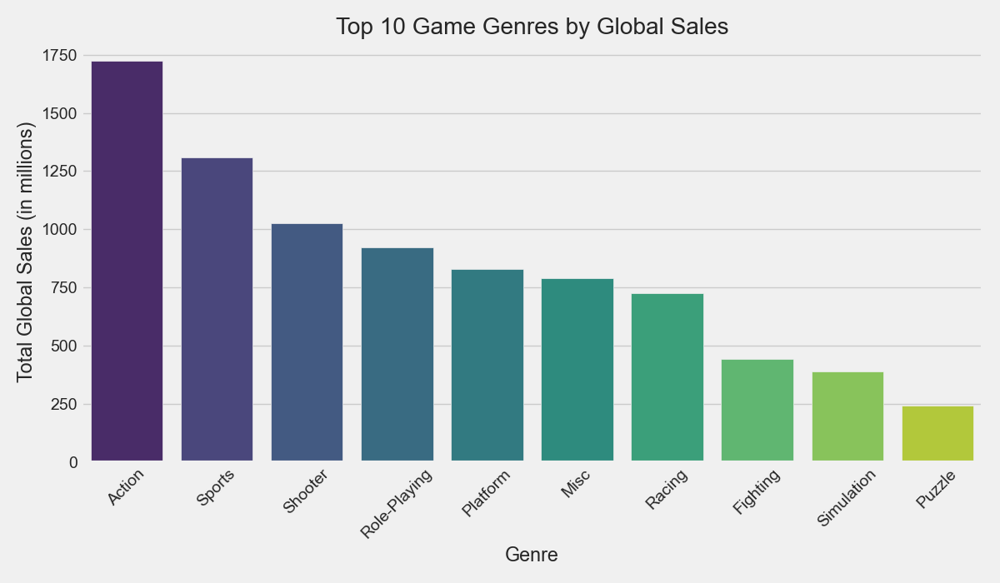
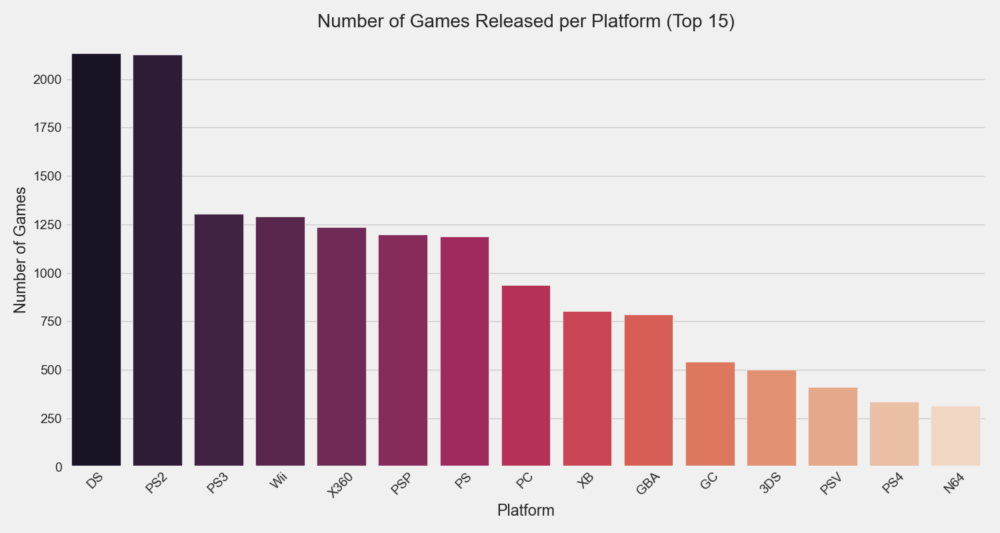
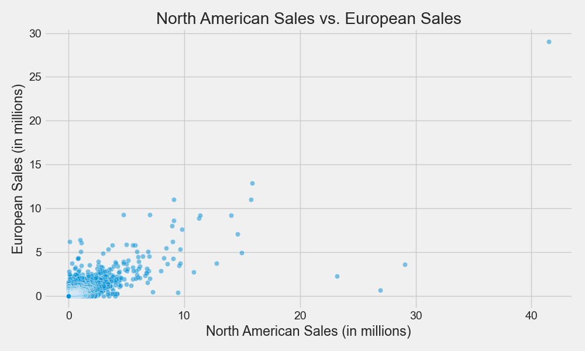
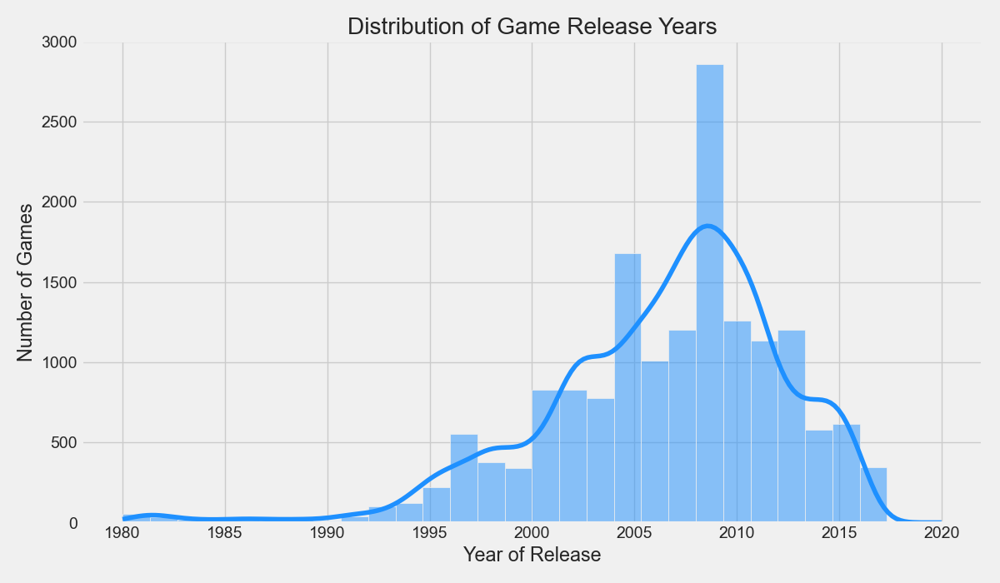
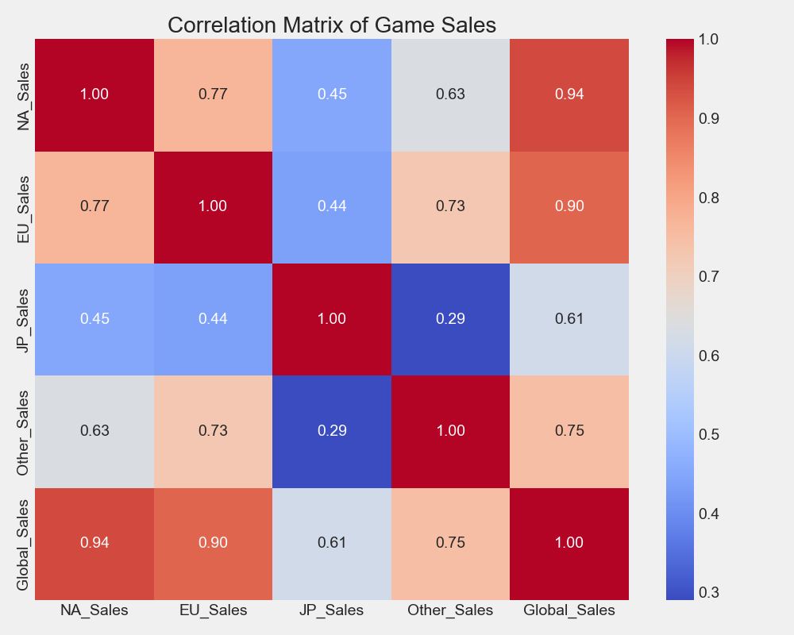
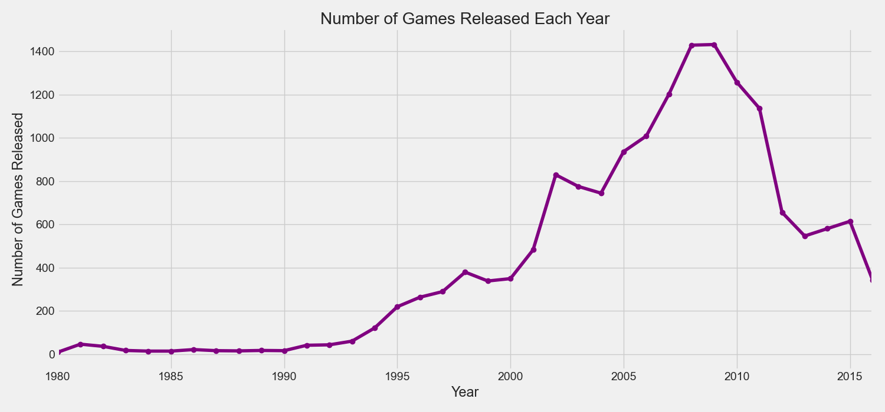
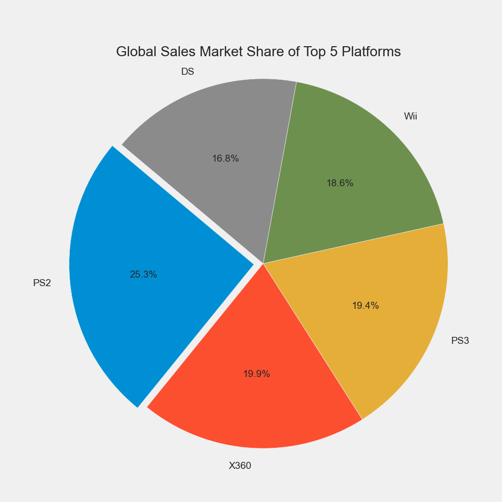
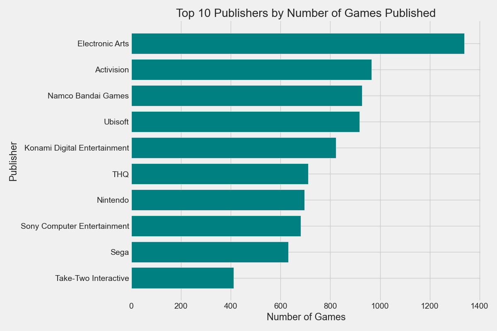
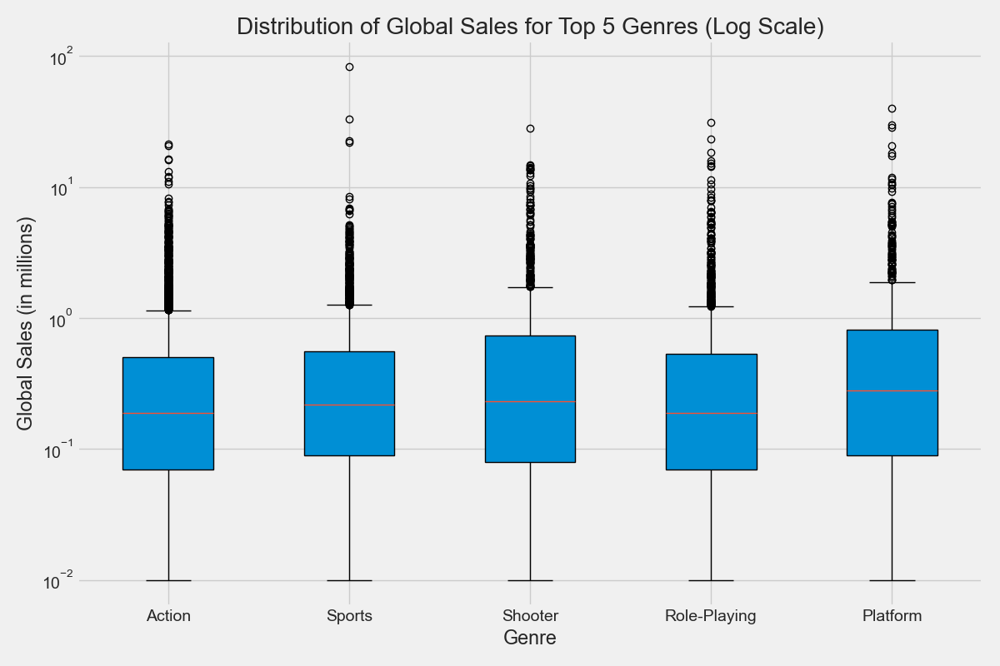
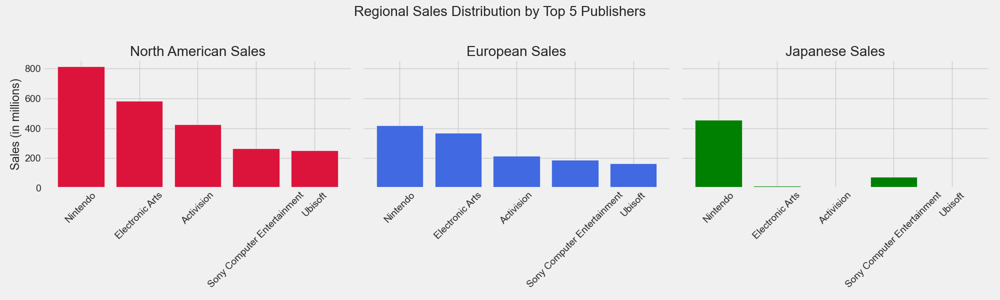

# Video Game Sales Data Visualization Project

## 📜 Description
This project is a comprehensive analysis and visualization of the Video Game Sales dataset from Kaggle. The goal is to uncover insights and trends within the video game industry using Python's powerful data visualization libraries, **Matplotlib** and **Seaborn**.

## 💾 Dataset
The dataset used is the "Video Game Sales" dataset, which contains sales data for over 16,500 video games. It was sourced from Kaggle.
- **File:** `vgsales.csv`
- **Columns include:** `Rank`, `Name`, `Platform`, `Year`, `Genre`, `Publisher`, `NA_Sales`, `EU_Sales`, `JP_Sales`, `Other_Sales`, `Global_Sales`.

---

## 📊 Visualizations

This project features 10 distinct visualizations to explore the data from different angles.

### Seaborn Visualizations

**1. Top 10 Game Genres by Global Sales**
This bar plot shows which game genres have generated the most sales globally.

**2. Number of Games Released per Platform (Top 15)**
This count plot illustrates the total number of games released for the top 15 most popular gaming platforms.

**3. North American Sales vs. European Sales**
This scatter plot explores the relationship between sales in North America and Europe for each game.

**4. Distribution of Game Release Years**
This histogram shows the frequency of game releases over the years, highlighting the growth of the industry.

**5. Correlation Matrix of Game Sales**
This heatmap visualizes the correlation between sales in different regions, showing how strongly they relate to each other.

### Matplotlib Visualizations

**6. Number of Games Released Each Year**
This line plot tracks the trend of game releases over time, from 1980 to 2016.

**7. Global Sales Market Share of Top 5 Platforms**
This pie chart shows the percentage of total global sales contributed by the top 5 gaming platforms.

**8. Top 10 Publishers by Number of Games Published**
This horizontal bar chart ranks the most prolific game publishers by the number of titles they have released.

**9. Distribution of Global Sales for Top 5 Genres**
This box plot displays the sales distribution for the top 5 genres, showing medians, quartiles, and outliers.

**10. Regional Sales Distribution by Top 5 Publishers**
These subplots compare the performance of the top 5 publishers across three major regions: North America, Europe, and Japan.

---

## 🚀 How to Run
1. Clone this repository to your local machine.
2. Ensure you have Python, Jupyter Notebook, pandas, Matplotlib, and Seaborn installed.
3. Open `visualization_project.ipynb` in Jupyter Notebook.
4. Run all the cells to generate the plots.
